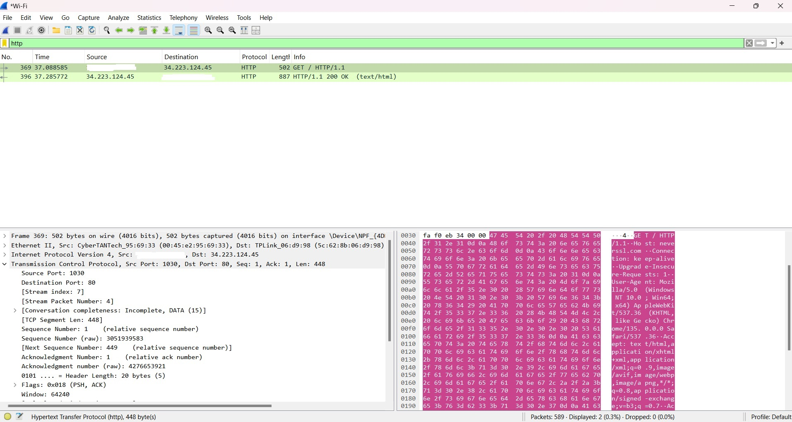

# analise-http-wireshark
Estudo técnico de análise de tráfego de rede com Wireshark

# Análise de Requisição HTTP com Wireshark

##  Objetivo
Capturar e analisar uma requisição HTTP usando o Wireshark.

##  Site acessado
http://neverssl.com

##  Informações da Requisição Capturada

- **IP de Origem:** localhost
- **IP de Destino:** 34.223.124.45
- **Porta de Origem:** 1030
- **Porta de Destino:** 80
- **Protocolo:** HTTP
- **Método:** GET
- **Host:** neverssl.com
- **TTL (Time to Live):** 128

##  Conclusão
Através desse estudo técnico eu consegui aprofundar meus conhecimento em: 
- **Wireshark**: ferramenta de captura e análise de pacotes de rede.
- **Tráfego de rede**: os dados transmitidos entre dispositivos, divididos em pacotes.
- **Pacotes e protocolos**: cada pacote possui cabeçalhos (headers) com informações de origem, destino, tipo de protocolo e outros metadados.
- **HTTP (Hypertext Transfer Protocol)**: protocolo usado para troca de informações na web.Os dados podem ser visualizados em texto claro pois não são criptografados.
- **TCP (Transmission Control Protocol)**: protocolo da camada de transporte que garante entrega confiável dos dados.
- **IP privado vs. IP público**: compreendi a diferença entre endereços usados dentro da rede local e aqueles que identificam dispositivos na internet.
---

###  Observações
- Esse tipo de análise é comum em redes internas e pode ajudar na detecção de tráfego suspeito.
- Visto que o protocolo HTTP não utiliza criptografia, ele não é seguro para o envio de senhas e informações pessoais. 
- Diferente do protocolo HTTP, na conexões HTTPS os dados trafegam protegidos devido à criptografia TLS
